<div align="center">

# Osman Furkan Küçük

**AI Engineer · Agentic RAG & LLM Systems**


<br/>

[](https://github.com/O7Furkan17)
[](https://github.com/O7Furkan17)
[](https://github.com/O7Furkan17)
[](https://github.com/O7Furkan17)
[](https://github.com/O7Furkan17)

</div>

---

```yaml
> whoami
role:        AI Engineer
focus:       agentic orchestrations · self-hosted LLM infrastructure · applied ML · R&D
working_on:  domain-grounded assistants, NL→SQL agents, MCP-driven workflows, healthcare AI systems
exploring:   evaluation pipelines, reasoning routing, edge-efficient intelligence
ethos:       "AI is not about models, it is about the systems they make possible"
```

<br/>

## 🌌 Stack Orbit

<div align="center">



</div>

<br/>

## ⚙ Tech Arsenal

<table>
<tr>
  <td valign="top" width="25%">

### `llm / models`


  </td>
  <td valign="top" width="25%">

### `training / inference`


  </td>
  <td valign="top" width="25%">

### `agents / data`


  </td>
  <td valign="top" width="25%">

### `infra / systems`


  </td>
</tr>
</table>

<br/>

## 🧪 Selected Work

<table>
<tr>
<td width="50%" valign="top">

### `›` Domain-Grounded Agentic Chatbot
Regulation-grounded Q&A assistant, served as an embeddable widget.<br/>
**Stack:** vLLM (Qwen) · LangGraph · Qdrant · Postgres · Redis · FastAPI · Docker

- LLM-driven **query expansion** → multi-shot retrieval → **rerank** → merge
- **Tool-calling loop** with bounded reasoning rounds, SSE streaming
- Atomic session state, isolated `iframe` embed, sub-second first token

</td>
<td width="50%" valign="top">

### `›` Turkish NL → SQL Analyst Agent
Natural-language to SQL over a multi-dialect enterprise schema.<br/>
**Stack:** Agentic pipeline · Oracle · MSSQL · Metadata graph · LLM planner

- **Metadata-first foundation:** schema graph, column glossary, samples
- Multi-stage agent: intent → plan → SQL synth → **safety validation** → run
- Built for non-technical analysts asking domain-specific questions

</td>
</tr>
<tr>
<td width="50%" valign="top">

### `›` Agentic Knowledge Base + MCP
Hybrid wiki + AI memory layer exposed via Model Context Protocol.<br/>
**Stack:** Obsidian · MCP servers · Custom agents · Python

- Living graph of architecture decisions, patterns, syntheses
- **MCP-exposed**: AI agents read/write the same graph humans browse
- Custom ingestion agents keep the graph fresh from live codebases

</td>
<td width="50%" valign="top">

### `›` Forecasting & Vision Side-Quests
Cross-paradigm experimentation across domains.<br/>
**Stack:** PyTorch · TensorFlow · YOLO · OpenCV · Pandas

- Diagnosis-aware demand forecasting — benchmarked **SARIMA → TCN → Transformer**
- Drone CV pipeline — waste detection + crowd density on edge-capture footage
- Multimodal moderation (text+image) and Android malware classification

</td>
</tr>
</table>

<br/>

## 📚 Research · Publications

- [doi.org/10.33545/26648776.2025.v7.i1a.74](https://doi.org/10.33545/26648776.2025.v7.i1a.74)
- [doi.org/10.1109/ICSH62408.2024.10779954](https://doi.org/10.1109/ICSH62408.2024.10779954)
- [doi.org/10.30538/psrp-easl2025.0120](https://doi.org/10.30538/psrp-easl2025.0120)
- [doi.org/10.54365/adyumbd.1334196](https://doi.org/10.54365/adyumbd.1334196)

<br/>

## 🛰 Connect

<div align="center">

<a href="https://www.linkedin.com/in/osmanfurkankucuk/">
  
</a>
<a href="https://github.com/O7Furkan17">
  
</a>

</div>

<br/>

<div align="center">

---

`while not asleep: build( ai )`

</div>
